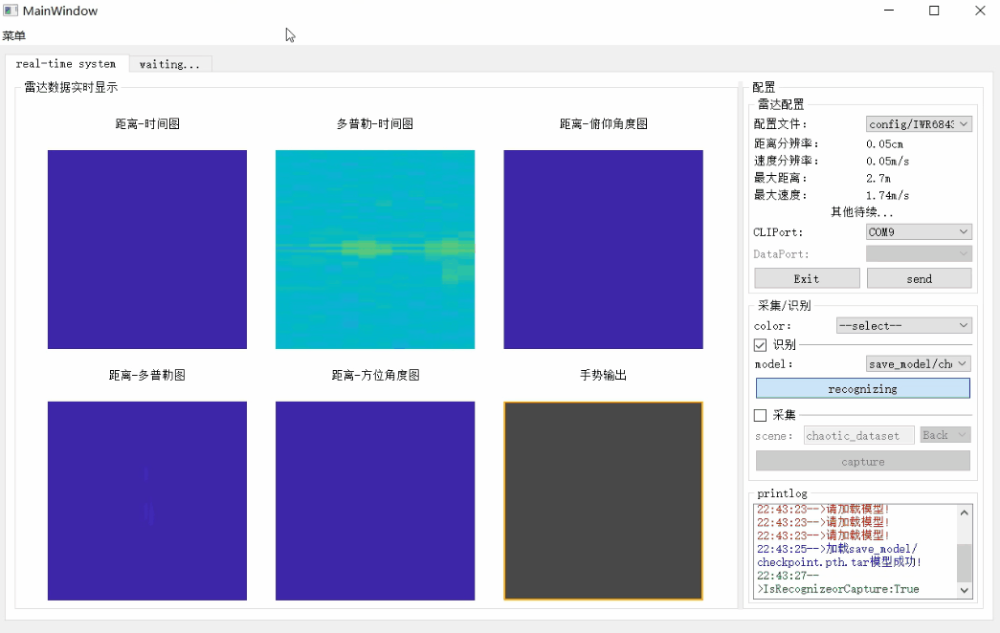

# RadarStream

RadarStream is a real-time RAWDATA acquisition, processing, and visualization system for TI MIMO mmWave radar series.

https://github.com/user-attachments/assets/7ce99b51-a1af-4025-8a84-ee580eb92d04

Demo1: Real-time Motion Detection and Radar Feature Visualization
<figure>
  
  <figcaption>Demo2: Real-time Gesture Recognition System</figcaption>
</figure>
